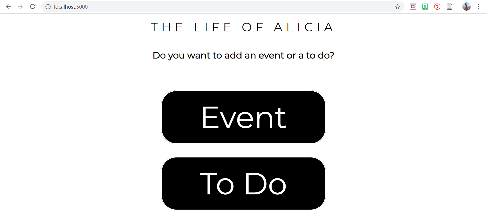
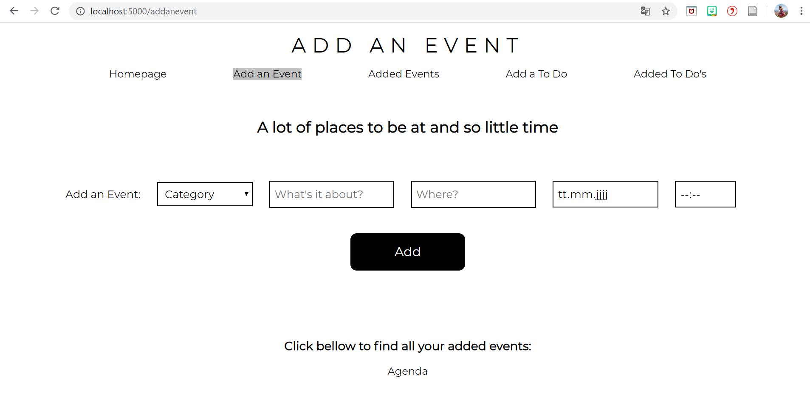
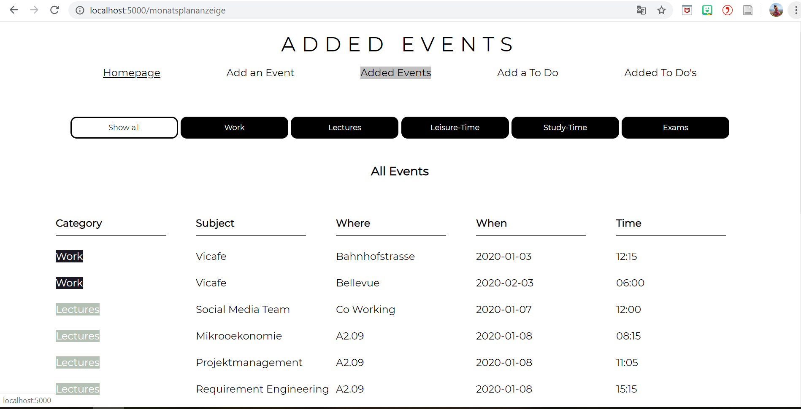
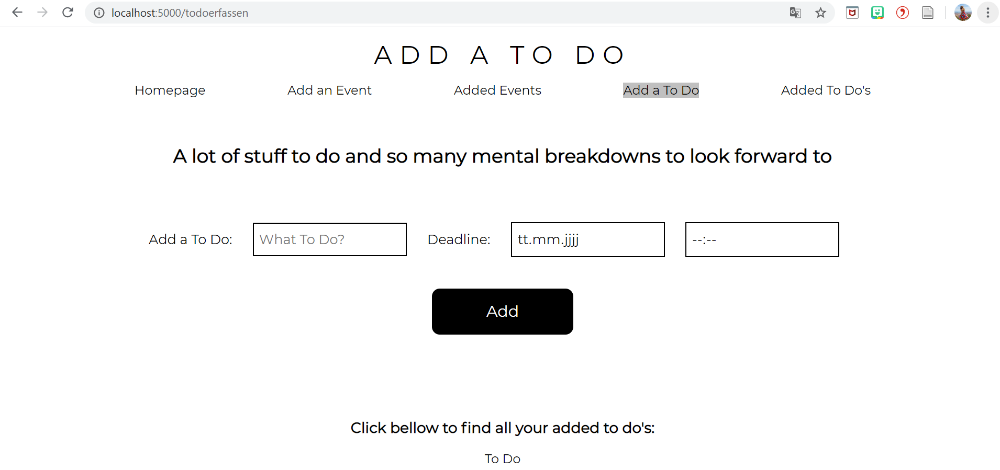
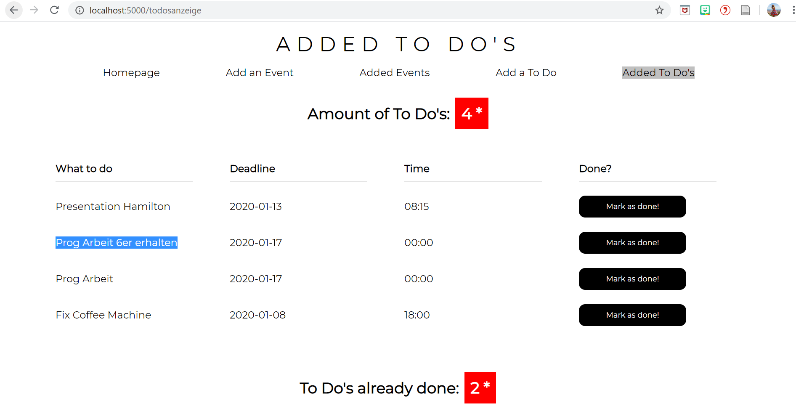

# Projektidee Alicia Fäh

Auflistung aller Events und To Do's aus meinem Leben 

## Ausgangslage:
Was ich bei meinem Kalender auf dem Handy manchmal vermisse ist eine Auflistung aller Termine auf einen Blick, sowie das seperate erfassen von To Do's. Die Erinnerungen App finde ich suboptimal. 

## Funktion/Projektidee:
Mit meiner Web Applikation kann ich Termine und To Do's erfassen. Events kann ich zusätzlich noch in verschiedene Kategorien einordnen, um diese übersichtlicher zu gestalten. 

## Problem:

1. Bei öffnen auf dem Localhost kann es vorkommen, dass das CSS nicht richtig einbezogen wird. In diesem Fall kann mit Strg + Shift + R die Seite neu geladen werden. Der zwischengespeicherte Inhalt wird dabei ignoriert.

2. Applikation hat Probleme mit Umlauten, keine Ahnung weshalb, wird noch im Hinterkopf gehalten, um Lösung für Problem zu finden.

3. Zwar kein Problem, aber in einem nächsten Schritt ermöglichen, dass die Events und To Do's noch bearbeitet werden können.
Und das sobald ein To Do als "Mark as Done" markiert wird wieder als "Undone" angewählt werden kann.

## Workflow:
Erster Entwurf, wird sich aber beim Programmieren sicherlich noch ändern..

## Walkthrough:
1. Start auf der Index Seite, Auswahl, ob ein Event oder ein To Do erfasst werden soll.
2. Eventuell mit Strg + Shift + R die Seite nue laden, weil zum Teil das CSS nicht einbezogen wird...

3. Kategorie auswählen, in welche der entsprechende Event fällt
4. Name des Events eingeben
5. Wo der Event stattfindet eingeben
6. Wann der Event stattfindet eingeben
7. Wann der Event beginnt eingeben
8. Auf Add klicken, um den Event zu speichern. -->Man wird automatisch auf die "added Events" Seite umgeleitet.

9. Solange "Show all" angewählt ist, werden alle Events aufgeführt, also auch jene in der Vergangenheit.
10. Sobald eine Kategorie angewählt wird, werden nur Events dieser Kategorie angezeigt und  nur jene die in der Zukunft stattfinden. 

11. Bei der "Add a To Do"-Seite zuerst eingeben was zu erledigen ist.
12. Bis wann es zu erledigen ist.
13. Bis zu welcher Uhrzeit es zu erledigen ist.
14. Auf Add klicken, um es zu speichern. -->Man wird automatisch auf die "added To Do's" Seite umgeleitet.

15. Im oberen Bereich sind dich noch offenen To Do's + eine Berechnung, die die Anzahl von To Do's anzeigt.
16. Sobald ein To Do erledigt wurde, kann man es mit "Mark as done!" erledigen. -->Interessant wäre das To Do "Prog Arbeit 6er erhalten" 
17. Im unteren Bereich werden die To Do's angezeigt die bereits erledigt wurden.

